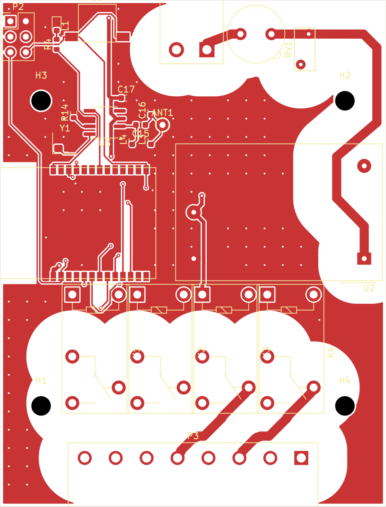
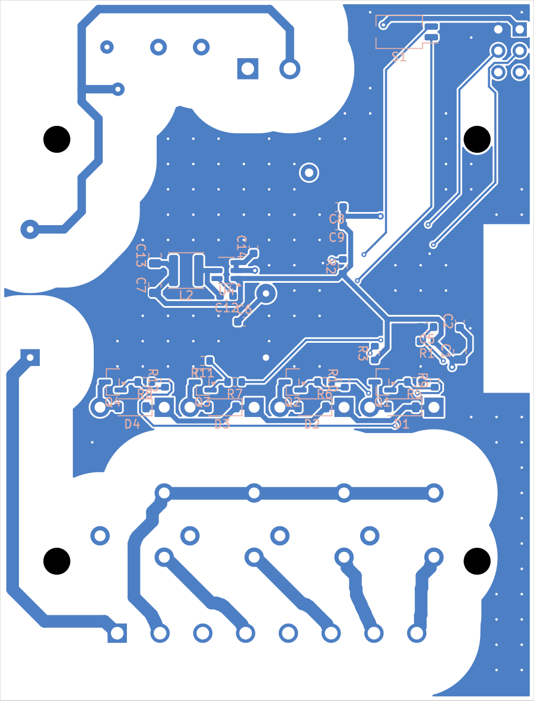
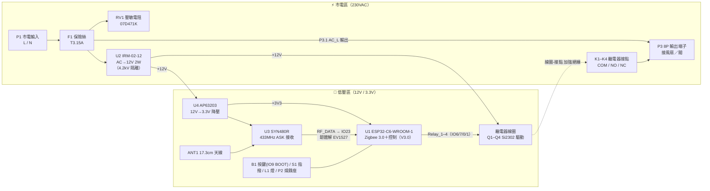
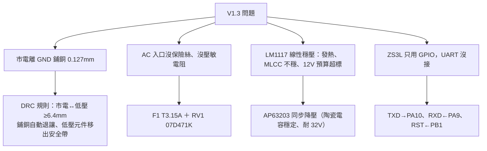
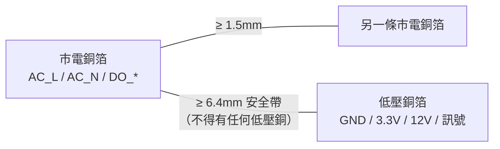
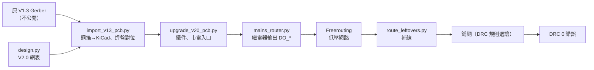
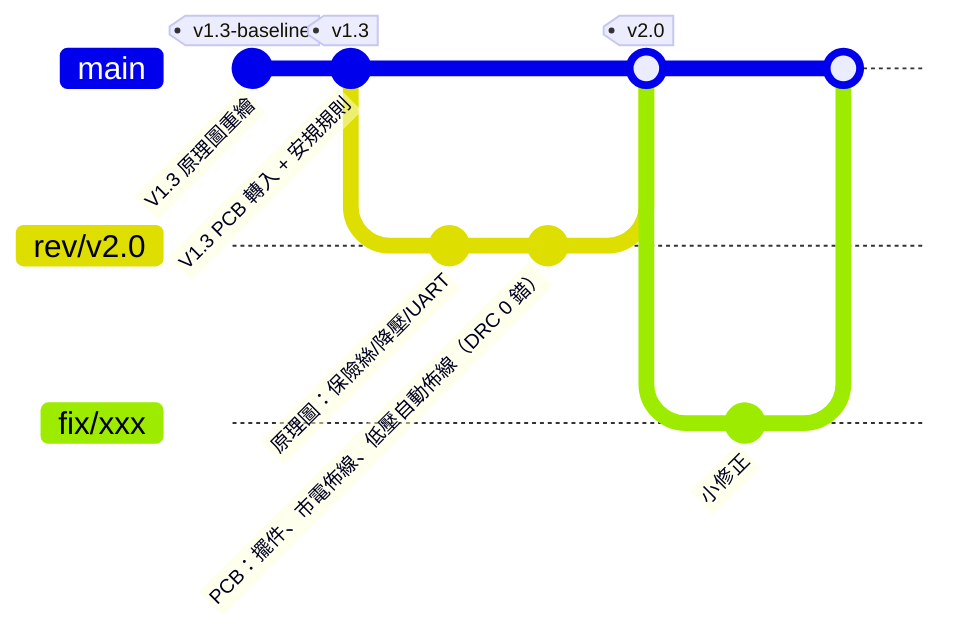
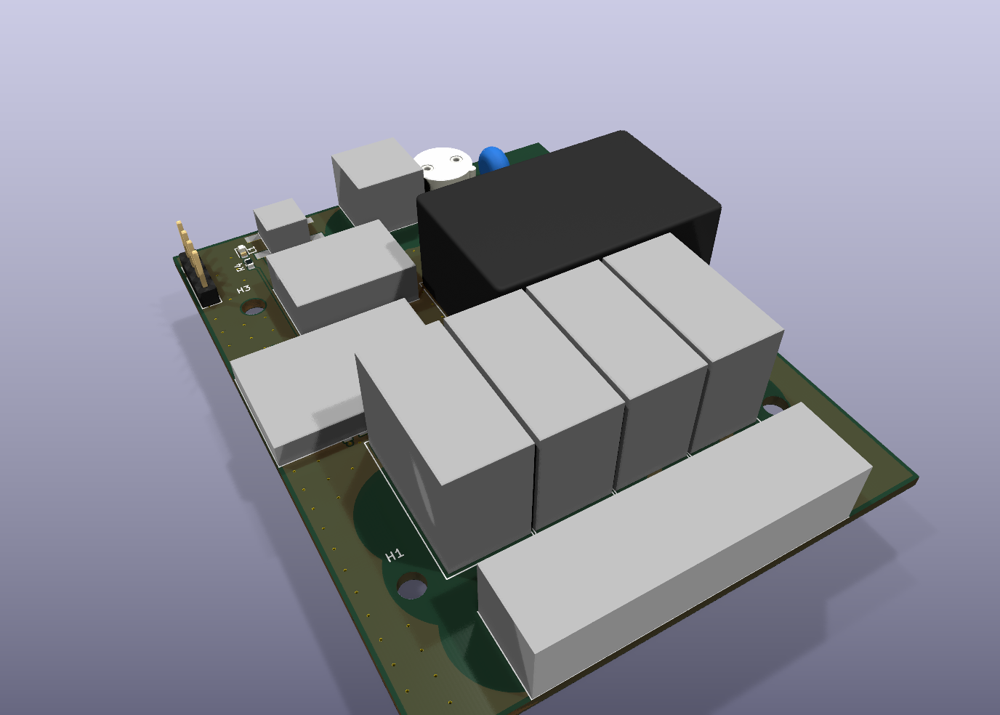

# Woow Zigbee 新風控制器 PCB（WO_30109）

[](https://github.com/WOOWTECH/Woow_zigbee_fresh_air_pcb/actions/workflows/kicad-ci.yml)

220V 供電、4 路繼電器輸出的 Zigbee 新風（換氣扇）控制板。V3.0 起由一顆 **ESP32-C6** 同時負責 Zigbee 3.0 連網與控制，433MHz 遙控由 **SYN480R** 接收、ESP32 解碼（V2.0 以前是 STM32F103＋Tuya ZS3L＋EPA09-4D 模組）。

這個 repo 是把原設計 **V1.3**（Altium，外包設計）完整轉成 **KiCad 10**，用 git 做版控，並在 **V2.0** 修掉安規問題。

| 版本 | 狀態 | 說明 |
|---|---|---|
| `v1.3` | 參考用，**不可量產** | 原設計忠實重繪（原理圖＋PCB）。市電與低壓 GND 只隔 0.127mm。（`v1.3-baseline` 只含原理圖） |
| `v2.0` | **DRC 0 錯誤**（已合併 `main`） | 市電隔離 ≥6.4mm、保險絲＋壓敏電阻、降壓電源、Zigbee 串口 |
| `v3.0` | 分支 `rev/v3.0`（PR 審查中） | ESP32-C6 單晶片 Zigbee＋SYN480R 433MHz，全部主料 JLC 可貼；市電區沿用 V2.0。見 [CHANGELOG](CHANGELOG.md#30--esp32-c6-單晶片syn480r分支-revv30) |

| V3.0 正面（零件面） | V3.0 背面 |
|---|---|
|  |  |

背面圖中藍色是 GND 鋪銅，白色帶是市電周圍 6.4mm 的安全帶（DRC 規則自動退讓）。完整原理圖：[V3.0](docs/images/schematic_v3.0.png)／[V2.0](docs/images/schematic_v2.0.png)。V3.0 左緣是 ESP32-C6 模組（天線端下方禁銅），左上是 SYN480R 433MHz 接收。

---

## 目錄

- [電路架構](#電路架構)
- [V1.3 → V2.0 改了什麼](#v13--v20-改了什麼)
- [安規隔離設計](#安規隔離設計)
- [Repo 結構](#repo-結構)
- [怎麼改設計（範例）](#怎麼改設計範例)
- [版本控制流程](#版本控制流程)
- [自動檢查（CI）](#自動檢查ci)
- [設計驗證報告](docs/verification/README.md)
- [主要料件](#主要料件)
- [已知限制與待辦](#已知限制與待辦)

---

## 電路架構

（V3.0；V2.0 以前低壓區是 STM32F103＋Tuya ZS3L＋EPA09-4D）



### 電源預算（12V，IRM-02-12 額定 167mA）

| 負載 | V1.3 | V2.0 |
|---|---|---|
| 4 顆繼電器全吸（33.3mA × 4） | 133mA | 133mA |
| 3.3V 側（約 40mA） | 線性穩壓：12V 端也是 ~45mA | 降壓：12V 端約 13mA |
| **合計** | **~178mA（超過額定）** | **~146mA（在額定內）** |

---

## V1.3 → V2.0 改了什麼



完整清單見 [CHANGELOG.md](CHANGELOG.md)，原設計審查見 [docs/review](docs/review)。

---

## 安規隔離設計

依 IEC 60664-1（230VAC、過電壓類別 II、汙染等級 2）設定，寫在 [`WO30109_FreshAir.kicad_dru`](hardware/WO30109_FreshAir/WO30109_FreshAir.kicad_dru)，KiCad DRC 與鋪銅都會自動遵守：

| 位置 | 要求 | V1.3 實測 | V2.0 |
|---|---|---|---|
| 市電 ↔ 低壓（含 GND 鋪銅） | ≥ 6.4mm（加強絕緣；與 G5Q 繼電器本身設計值相同） | **0.127mm** | ≥ 6.4mm |
| 市電不同網路之間（L-N、各路輸出） | ≥ 1.5mm（功能絕緣；G5Q 相鄰接點腳本身 1.67mm） | 0.5mm | ≥ 1.5mm |
| 銅到板邊 | ≥ 0.5mm | 0.26mm | ≥ 0.5mm |
| 固定孔（非金屬化）到市電 | ≥ 2.3mm（M3 螺絲頭多出孔外 1.15mm＋餘量）；**須用尼龍螺絲** | 1.77mm | 2.40–2.90mm |



**怎麼確認**：在 KiCad 開 PCB → 檢查 → 設計規則檢查（DRC），或命令列：

```bash
kicad-cli pcb drc --severity-error hardware/WO30109_FreshAir/WO30109_FreshAir.kicad_pcb
```

---

## Repo 結構

```text
.
├── hardware/
│   ├── WO30109_FreshAir/          # KiCad 專案（用 KiCad 10 開 .kicad_pro）
│   │   ├── WO30109_FreshAir.kicad_sch   # 原理圖（由 scripts 產生）
│   │   ├── WO30109_FreshAir.kicad_pcb   # PCB
│   │   ├── WO30109_FreshAir.kicad_dru   # 安規 DRC 規則
│   │   ├── WO30109_FreshAir.kicad_jobset # 一鍵產出（ERC/DRC/Gerber/BOM/STEP）
│   │   └── sym-lib-table / fp-lib-table # 指向 ../lib 的專案庫
│   └── lib/
│       ├── WOOW.kicad_sym         # 自訂符號：ZS3L、EPA09-4D
│       ├── WOOW.pretty/           # 自訂封裝（焊盤量測自原板）
│       └── WOOW.3dshapes/         # 自訂 3D 模型
├── docs/verification/             # 設計驗證報告
├── scripts/
│   ├── design.py                  # ★ 電路唯一來源：零件、腳位、網路、改版差異
│   ├── gen_schematic.py           # design.py → .kicad_sch
│   ├── make_footprints.py         # 產生 WOOW.pretty
│   ├── import_v13_pcb.py          # 原 Gerber → KiCad PCB（需原始 Gerber，不公開）
│   ├── upgrade_v20_pcb.py         # V2.0 擺件與市電入口走線
│   ├── mains_router.py            # 雙層格點佈線器（市電間 1.5mm、對低壓 6.4mm）
│   ├── route_v20.py               # Freerouting 低壓佈線 + 鋪銅
│   ├── route_leftovers.py         # 補繞 Freerouting 沒繞通的線
│   ├── build_v20.sh               # ★ 一鍵重建 V2.0 PCB
│   ├── drc_summary.py             # DRC 結果摘要
│   ├── add_stitching.py           # GND 縫合過孔
│   ├── make_3d_models.py          # 自訂零件 3D 模型（STEP）
│   └── assign_3d.py               # 3D 模型掛到封裝
├── sim/                           # SPICE 模擬（ngspice）
├── docs/review/                   # 設計審查報告
├── .github/workflows/kicad-ci.yml # 自動 ERC / DRC / 生產檔
├── CHANGELOG.md
└── README.md
```

---

## 怎麼改設計（範例）

原理圖由 `scripts/design.py` 產生，**改電路請改 design.py，不要直接在 KiCad 手改原理圖**（下次產生會被蓋掉）。PCB 可以直接在 KiCad 改。

### 範例 1：把 R4（LED 限流）從 100Ω 改成 220Ω

```python
# scripts/design.py
add("R4", "Device:R", "220R", R0603, "C22962", {"1": led_net, "2": "LED_A"})
```

```bash
python scripts/gen_schematic.py 2.0          # 重新產生原理圖
kicad-cli sch erc hardware/WO30109_FreshAir/WO30109_FreshAir.kicad_sch
# 開 KiCad PCB → 工具 → 從原理圖更新 PCB（F8）
git switch -c fix/led-resistor
git commit -am "fix: R4 改 220R，降低 LED 亮度"
git push -u origin fix/led-resistor && gh pr create
```

### 範例 2：在 KiCad 圖形介面裡用 Git

KiCad 9 起專案管理器內建 Git（檔案樹會顯示修改狀態、可 commit / push / pull / 切分支）。KiCad 9.0.0 的 push/pull 帳密處理曾有回報問題，建議 commit 用 KiCad、push 用命令列或 `gh`：

1. 用 KiCad 開 `hardware/WO30109_FreshAir/WO30109_FreshAir.kicad_pro`
2. 左側檔案樹按右鍵 → **Git** → Commit / Push / Switch branch
3. 偏好設定 → Version Control 可設定作者與遠端更新頻率

### 範例 3：重建整片 V2.0 PCB



```bash
# 需要 KiCad 10、Java 17、xvfb-run、Freerouting 1.9 jar、kicad-sch-api
ORIG_GERBER=/path/to/V1.3_gerber ./scripts/build_v20.sh
```

Freerouting 每次結果不完全一樣；跑完一定看最後的 DRC 摘要，`errors: {}` 且 `unconnected: 0` 才算成功。

---

## 版本控制流程



| 規則 | 說明 |
|---|---|
| `main` | 永遠是可以生產的狀態（CI 綠燈） |
| `rev/vX.Y` | 一次改版一個分支，完成後開 PR 合併 |
| `fix/…`、`feat/…` | 小修改 |
| 標籤 `vX.Y` | 送廠的版本；Gerber、BOM、座標檔附在 GitHub Release |
| commit 訊息 | `feat:` 新功能、`fix:` 修正、`docs:` 文件，內文寫「改了什麼、為什麼」 |

**為什麼 KiCad 適合 git**：`.kicad_sch`、`.kicad_pcb`、`.kicad_sym`、`.kicad_mod` 都是純文字（S-expression），`git diff` 看得到每一行的變化；暫存檔（`*.kicad_prl`、`*-backups/`、`fp-info-cache`）已在 `.gitignore` 排除。要看圖形化差異可用 [KiRI](https://github.com/leoheck/kiri) 或 [kicadiff](https://github.com/sksat/kicadiff)。

---

## 自動檢查（CI）

每次 push 或開 PR，GitHub Actions（`kicad/kicad:10.0` 容器）會：


任何 ERC/DRC **錯誤**都會讓 CI 變紅燈，不能合併到 `main`。CI 也會跑 SPICE（繼電器關斷尖峰必須 < 20V）並輸出 STEP 3D 檔。

本機一鍵產出（不需要 GitHub）：KiCad 專案管理器點 `WO30109_FreshAir.kicad_jobset`，或

```bash
cd hardware/WO30109_FreshAir && kicad-cli jobset run --file WO30109_FreshAir.kicad_jobset WO30109_FreshAir.kicad_pro
```

---

## 設計驗證

完整報告：**[V3.0](docs/verification/V3.0.md)**（ESP32-C6＋SYN480R，含電源預算、433 匹配模擬）／[V2.0](docs/verification/README.md)

| 項目 | 結果 |
|---|---|
| ERC／DRC（含市電安規）／parity | 0／0／0 |
| SPICE（ngspice） | 8 子電路全過；繼電器關斷尖峰 12.8V（拿掉續流二極體時 251V） |
| PCB 計算器（IPC-2221） | ⚠️ 市電 1.5mm 線在 1oz 銅剛好等於保險絲 3.15A；>3A 負載請選 2oz 銅 |
| 熱分析 | 最壞 2.6W；IRM-02 在此負載環境上限約 74°C |
| EMC 預檢 | 風險分數 49/100，多數為市電隔離的刻意設計；量產前需實測預掃 |
| 3D／STEP | 正面最高 16.9mm、背面 4.3mm；STEP 由 CI 產生 |
| Jobset | 8/8 工作成功（KiCad 原生一鍵產出） |



---

## 主要料件

| 位號 | 料件 | LCSC | 備註 |
|---|---|---|---|
| U1 | ESP32-C6-WROOM-1-N8（V3.0） | C5366877 | Zigbee 3.0／Wi-Fi 6／BLE 5，PCB 天線（V2.0：STM32F103C8T6 C8734） |
| U2 | MEAN WELL IRM-02-12 | C7211213 | 230VAC→12V 2W |
| U3 | SYN480R（V3.0） | C916347 | 433.92MHz ASK 接收；Y1 13.52127MHz C654957（V2.0：Tuya ZS3L，JLC 無料） |
| U4 | AP63203WU-7（V2.0） | C780769 | 12V→3.3V 降壓 |
| L2 | SWPA4030S3R9MT 3.9µH（V2.0） | C96899 | 規格書 Table 2 建議值 |
| K1–K4 | Omron G5Q-1 DC12 | C397244 | 250VAC：NO 5A、NC 3A |
| F1 | 保險絲 T3.15A 250V（V2.0） | — | TR5 座，手焊 |
| RV1 | 07D471K（V2.0） | C28756 | |
| ANT1 | 433MHz 1/4 波長天線（V3.0） | — | 17.3cm 導線或彈簧天線，手焊（V2.0：RF1 EPA09-4D，規格書未公開） |

完整 BOM 由 CI 產生（`*-bom.csv`）。

---

## 已知限制與待辦

- **V3.0 電源預算**：IRM-02-12 額定 167mA。韌體預設同時吸合 ≤3 顆、Zigbee 發射 +10dBm、不啟動 Wi-Fi → 峰值約 158mA，在額定內；4 顆全吸時發射峰值約 191mA，超過 110% 保護點。根治要改 IRM-03-12（封裝不同，市電要重佈）。計算見 [V3.0 驗證報告](docs/verification/V3.0.md#6-電源預算)。
- **V3.0 433MHz**：SYN480R 只輸出解調後的原始波形，遙控器編碼（EV1527／PT2262）要在 ESP32 韌體解；匹配元件值照規格書典型應用，實際天線長度與匹配要打樣後用遙控器實測距離微調。
- **V3.0 ESP32 天線**：模組天線端貼左板邊、下方兩層禁銅；外殼若是金屬或天線端靠近金屬，Zigbee 距離會明顯縮短，必要時改外接天線版 ESP32-C6-WROOM-1U（腳位相同、本體短 6.3mm；2026-10-03 查 JLC 0 庫存，要客供）。
- **繼電器負載**：G5Q-1 在 250VAC 只有 NO 5A／NC 3A，沒有馬達額定；多段速風扇要在韌體互鎖，避免兩檔同時吸合。
- **固定孔一律用尼龍螺絲／絕緣支柱**：V2.0 孔邊到市電銅箔 2.4–2.9mm（DRC 規則 `hole_to_mains` ≥ 2.3mm），足夠避開螺絲頭，但達不到市電對可觸及金屬的 6.4mm，所以不能用金屬螺絲接金屬外殼。
- **韌體**：V3.0 韌體在 [`firmware/`](firmware/README.md)（ESP-IDF v5.5.4＋esp-zigbee-lib v2）：Zigbee 路由器 4 個開關端點、指撥 4 種模式與風速互鎖、EV1527 遙控器學習、按鍵／燈號。主機端單元測試與完整編譯都在 CI。實際入網與遙控器相容性要打樣後驗證。
- 原始 Altium 檔、Gerber、請款單等外包資料**不公開**，不在本 repo。

---

## 資料來源

- MEAN WELL IRM-02 規格書：<https://www.meanwell.com/Upload/PDF/IRM-02/IRM-02-SPEC.PDF>
- Omron G5Q：<https://omronfs.omron.com/en_US/ecb/products/pdf/en-g5q.pdf>
- Tuya ZS3L：<https://developer.tuya.com/en/docs/iot/zs3l?id=K97r37j19f496>
- Espressif ESP32-C6-WROOM-1 規格書 v1.4：<https://documentation.espressif.com/esp32-c6-wroom-1_wroom-1u_datasheet_en.pdf>
- JSMSEMI SYN480R 規格書：LCSC C916347
- Diodes AP63203：<https://www.diodes.com/assets/Datasheets/AP63200-AP63201-AP63203-AP63205.pdf>
- IEC 60664-1 間距表（TI SLUP421）：<https://www.ti.com/lit/pdf/SLUP421>
- KiCad Git 整合：<https://docs.kicad.org/9.0/en/kicad/kicad.html>
