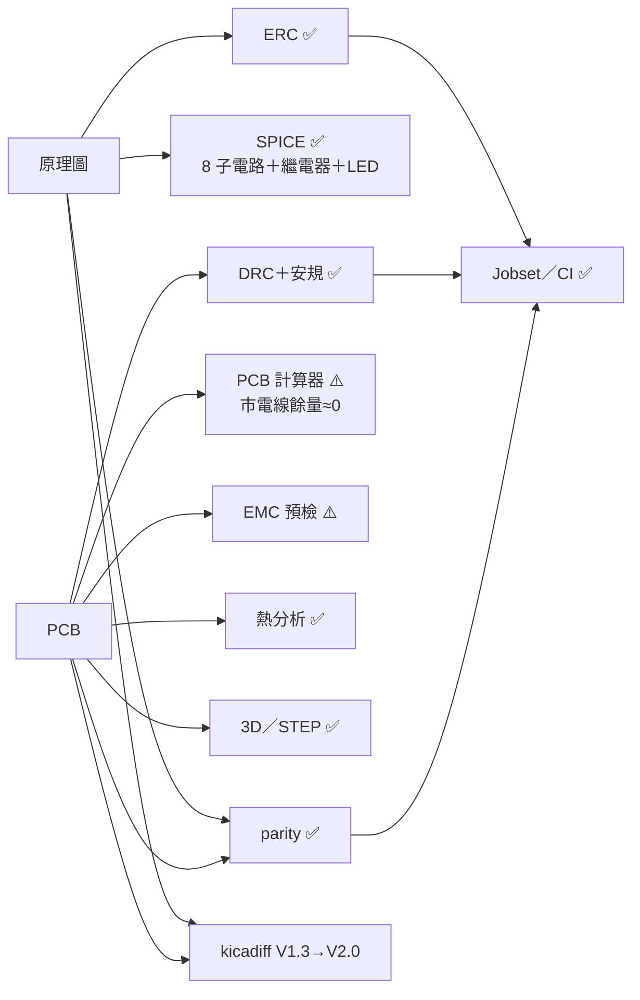
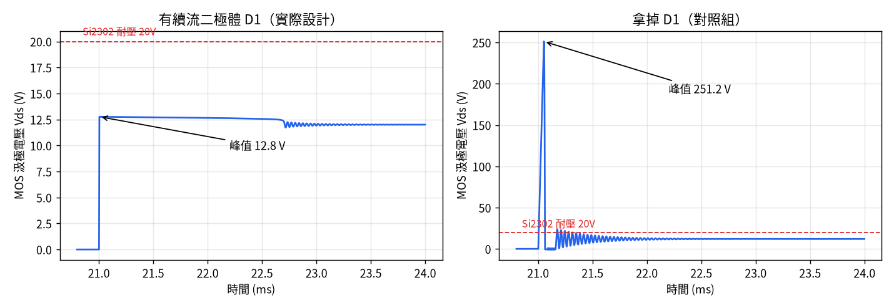
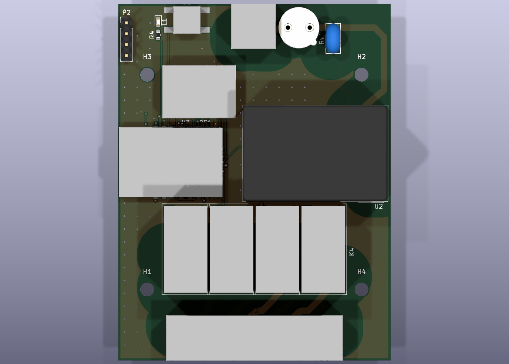
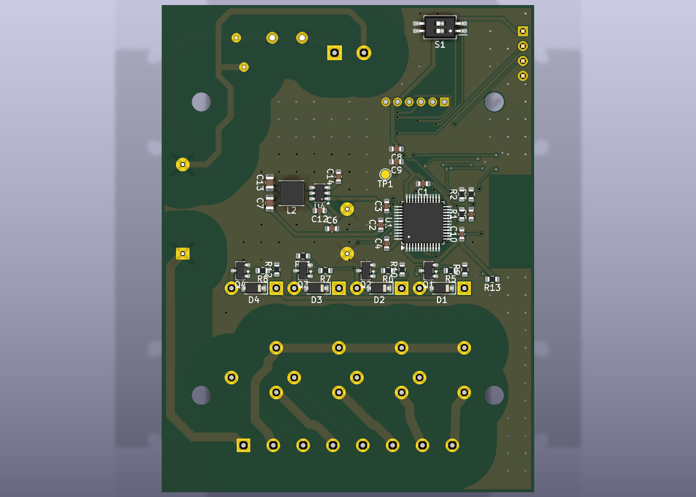

# V2.0 設計驗證報告

對象：`v2.0` 之後的 `main`（加上 GND 縫合過孔與 3D 模型）。日期 2026-10-02。
工具：KiCad 10.0.6（kicad-cli）、ngspice 42、kicad-happy 分析器（schematic / pcb / emc / spice / thermal）、kicadiff、OCP（OpenCASCADE）。

## 總表

| # | 驗證項目 | 工具 | 結果 | 判定 |
|---|---|---|---|---|
| 1 | 原理圖電氣規則（ERC） | kicad-cli | 0 個錯誤 | ✅ |
| 2 | 佈線規則（DRC）＋市電安規自訂規則 | kicad-cli＋`.kicad_dru` | 0 錯誤、0 未連線 | ✅ |
| 3 | 原理圖與 PCB 一致（parity） | kicad-cli | 0 不一致 | ✅ |
| 4 | SPICE：自動辨識子電路 | kicad-happy spice＋ngspice | 8 項全過 | ✅ |
| 5 | SPICE：繼電器驅動關斷尖峰 | ngspice（`sim/relay_driver.cir`） | 12.8V（耐壓 20V） | ✅ |
| 6 | SPICE：藍光 LED 電流 | ngspice（`sim/led.cir`） | 3.8–7.1mA | ✅ |
| 7 | PCB 計算器：走線／過孔載流 | IPC-2221（與 KiCad 計算器同公式） | 市電線餘量≈0（見下） | ⚠️ |
| 8 | PCB 計算器：分壓、時間常數 | 手算＋SPICE | 符合設計 | ✅ |
| 9 | 熱分析 | 規格書功耗＋降額曲線 | 最壞 2.6W，無需散熱片 | ✅ |
| 10 | EMC 預檢（CISPR 32 Class B） | kicad-happy emc | 風險分數 49/100（多為刻意設計） | ⚠️ |
| 11 | 3D／STEP 外形 | kicad-cli＋OCP | 正面高 16.9mm、背面 4.3mm | ✅ |
| 12 | 版本差異 V1.3 → V2.0 | kicadiff | 新增 15、變更 17 顆 | — |
| 13 | 一鍵產出（Jobset） | KiCad Jobset | 8/8 工作成功 | ✅ |



---

## 1–3. ERC／DRC／parity

```bash
kicad-cli sch erc --severity-error --exit-code-violations hardware/WO30109_FreshAir/WO30109_FreshAir.kicad_sch
kicad-cli pcb drc --schematic-parity --severity-error --exit-code-violations hardware/WO30109_FreshAir/WO30109_FreshAir.kicad_pcb
```

兩者結束碼皆為 0。DRC 包含 `.kicad_dru` 的 5 條安規規則：市電↔低壓 6.4mm、市電網路間 1.5mm、板邊 0.5mm、固定孔↔市電 2.3mm。剩下的只有絲印重疊類警告（不影響生產）。

> 注意：`.kicad_dru` 必須和 `.kicad_pcb` 放在一起。少了它，市電↔低壓 6.4mm 的檢查就不存在（kicadiff 的暫存目錄比對就是這樣漏掉的）。MAINS 網路類別間距已統一為 1.5mm，與規則一致。

---

## 4–6. SPICE 模擬

### kicad-happy 自動辨識（8 項全過）

| 子電路 | 結果 |
|---|---|
| R1/C5 重置 RC | 截止 158.8Hz（設計 159.2Hz） |
| Q1–Q4 Si2302 | Vth 1.54V、導通 |
| 3.3V 去耦（C7/C13/C1/C2/C3） | 1MHz 阻抗 4.6mΩ |
| 12V 去耦（C6/C14） | 1MHz 阻抗 33mΩ |
| 3.3V 上電湧浪 | 0.18A，穩定於 3.3V |

### 繼電器驅動（`sim/relay_driver.cir`）

線圈參數依 Omron G5Q-1 DC12 規格書（360Ω、33.3mA）；線圈電感規格書未列，取 200mH（同級小型繼電器 100–500mH）。

| 量測 | 結果 | 規格 |
|---|---|---|
| 線圈電流 | 33.3mA | 規格書 33.3mA |
| 閘極電壓 | 3.00V（R5 1k / R9 10k 分壓） | Si2302 Vth 0.63V |
| 導通 Vds | 0.57mV | — |
| **關斷尖峰（有 D1）** | **12.76V** | Si2302 Vds max 20V（餘量 36%） |
| **關斷尖峰（拿掉 D1）** | **251V** | 會擊穿 MOS → D1–D4 不可省 |
| 續流峰值電流 | 33mA | 1N4148W 遠高於此 |
| 線圈電流衰減到 1mA | 1.3ms | 繼電器釋放時間規格 5ms |



### 藍光 LED（`sim/led.cir`）

模型校正到規格書 Vf=3.0V@20mA，再以 Vf 偏高／偏低兩組模型包夾：**3.8–7.1mA（典型 4.9mA）**，低於 LED 20mA 與 STM32 GPIO 25mA。

---

## 7–8. PCB 計算器

公式：IPC-2221 外層 I = 0.048·ΔT^0.44·A^0.725（KiCad PCB 計算器 Track Width 頁同一公式）。外層 1oz（35µm）、ΔT=10°C。

| 網路 | 線寬 | 可承載 | 需求 | 倍數 |
|---|---|---|---|---|
| AC_L／DO_COM／各路輸出 | 1.5mm | 3.21A（ΔT20：4.35A） | 3.15A（保險絲） | **1.0** ⚠️ |
| AC_N | 1.0mm | 2.39A | 0.05A | 48 |
| +12V | 0.6mm | 1.65A | 0.15A | 11 |
| COIL1–4 | 0.6mm | 1.65A | 0.034A | 49 |
| SW（降壓） | 0.6mm | 1.65A | 0.6A | 2.8 |
| +3V3 最細段 | 0.3mm | 1.00A | 0.1A | 10 |
| 過孔 0.6/0.3 | — | 0.8A | 訊號級 | — |

**發現**：市電走線在 1oz 銅下剛好等於保險絲電流，沒有餘量。
- 風扇總電流 ≤ 3A（一般新風機 <1A）：可接受。
- 要用到繼電器 5A：下單選 **2oz 銅**（1.5mm → 5.3A），並同步換大保險絲。

| 分壓／時間常數 | 值 |
|---|---|
| MOS 閘極 R5/R9 | 3.3×10/11 = 3.00V |
| 重置 R1×C5 | 10k×100nF = 1.0ms |
| LED R4 | 100Ω → 3.8–7.1mA |
| AP63203 | 固定 3.3V 輸出，無外部分壓 |

---

## 9. 熱分析

kicad-happy 的熱分析器需要零件料號＋規格書擷取快取，本專案只有 LCSC 碼而跳過；改用規格書數據手算（`raw/thermal_manual.json`）。

| 零件 | 功耗 | 說明 |
|---|---|---|
| K1–K4 線圈 | 1.60W | 4×400mW（全吸最壞） |
| U2 IRM-02-12 | 0.62W | 輸出 1.75W＝額定 88%；降額曲線 70°C 前滿載、85°C 60% → **環境上限約 74°C** |
| 市電走線 | 0.35W | 保險絲上限 3.15A 時；實際 <1A 時 <0.04W |
| U4 AP63203 | 0.02W | V1.3 的 LM1117 是 0.35W、溫升約 +47°C |
| 其他 | <0.02W | — |
| **合計** | **≈2.6W** | 無需散熱片；密閉小盒須確認箱內 ≤60°C |

---

## 10. EMC 預檢（CISPR 32 Class B）

風險分數 49/100：error 18、warning 33、info 12。逐項判讀：

| 規則 | 數量 | 判讀 |
|---|---|---|
| GP-001 市電網路下方無參考平面 | 10 | **刻意設計**：安規要求市電下方不能有 GND |
| ES-001/002 RV1「離 P1 遠、無接地過孔」 | 2 | **誤判**：RV1 是 L-N 壓敏電阻，本就不接地、且須在保險絲之後 |
| GP-004 GND 鋪銅比例低 | 2 | 刻意設計（6.4mm 市電安全帶） |
| GP-001 低壓訊號跨越鋪銅縫隙 | 15 | 雙層板走線切割鋪銅；訊號皆為慢速 GPIO |
| RP-001 換層缺 GND 過孔 | 21 | 已加 88 顆縫合過孔＋訊號過孔旁 3 顆；MCU 區太密，58 個訊號過孔旁沒有空位 |
| SW-001 AP63203 諧波 30–960MHz | 4 | AP63203 內建展頻（FSS ±6%，規格書 §5）；輸入電容 C14 中心距 U4 約 4mm，下一版可再靠近以縮小開關迴路 |

結論：真正的 EMC 風險集中在降壓 IC 與繼電器切換市電。**正式認證前建議做傳導／輻射預掃**；MCU 區要徹底改善需改 4 層板或重新佈局。

---

## 11. 3D／STEP


| 正面 | 背面 |
|---|---|
|  |  |

| 項目 | 數值 |
|---|---|
| 外形 | 63.4 × 83.08mm |
| 正面最高（含板厚） | 16.9mm（G5Q 繼電器 15.3mm） |
| 背面最低 | −4.3mm（插件腳） |
| 外殼建議淨空 | 正面 ≥ 22mm（含端子插頭）、背面 ≥ 5mm |

自訂零件（G5Q、ZS3L、EPA09-4D、端子、按鍵）的 3D 模型由 `scripts/make_3d_models.py` 依規格書尺寸產生（本體方塊＋插件腳），只用於干涉與高度檢查。STEP 檔由 CI 每次產生（Artifacts → `WO30109_FreshAir.step`）。

---

## 12. 版本差異（kicadiff）

完整報告：[diff/v1.3_vs_v2.0.md](diff/v1.3_vs_v2.0.md)（原理圖新增 15、變更 17 顆；PCB 前後對照圖）。

```bash
kicadiff --markdown --output-dir docs/verification/diff -o docs/verification/diff/v1.3_vs_v2.0.md v1.3 v2.0 hardware/WO30109_FreshAir/WO30109_FreshAir.kicad_pcb
```

---

## 13. Jobset（KiCad 原生一鍵產出）

`hardware/WO30109_FreshAir/WO30109_FreshAir.kicad_jobset`：ERC → DRC → Gerber → 鑽孔 → 座標 → BOM → 原理圖 PDF → STEP，8/8 成功。ERC/DRC 只有「錯誤」等級才算失敗（`severity: 4`）。

```bash
kicad-cli jobset run --file WO30109_FreshAir.kicad_jobset WO30109_FreshAir.kicad_pro   # 在 hardware/WO30109_FreshAir/ 內執行
```

KiCad GUI：專案管理器左側檔案樹點 `.kicad_jobset` → Generate All Outputs。

---

## 待辦

| 項目 | 優先 |
|---|---|
| 負載 >3A 時改 2oz 銅＋換保險絲 | 依風扇規格 |
| 正式認證前 EMC 傳導／輻射預掃 | 高（量產前） |
| EPA09-4D 規格書（3D 高度、電壓） | 中 |
| ZS3L 實際高度（3D 模型為估計 3.3mm） | 低 |
| G5Q 線圈電感實測（SPICE 取 200mH） | 低 |

## 原始資料

`raw/`：kicad-happy 分析器 JSON（schematic、pcb、emc、spice）、`pcb_calculator.json`、`thermal_manual.json`、`3d_envelope.json`、`track_widths.json`。
