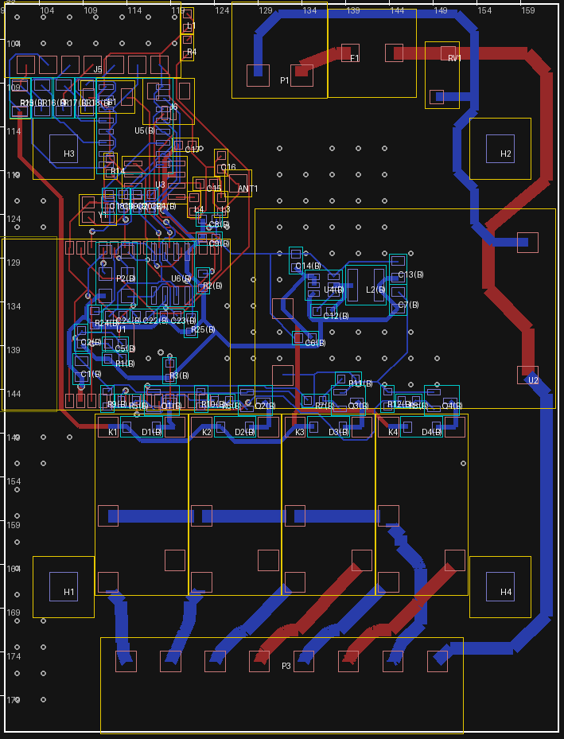

# V3.4 驗證報告：照外殼 4-02-3 放回原板框

## 為什麼有 V3.4

使用者指定的外殼是**精鋼塑模 4-02-3**：35mm 導軌式開關盒，外形 88×72×59mm，4 個螺絲間距 50×50mm，ABS 材質。

原板 63.4×83.08mm，4 個固定孔間距 49.9×50.03mm，而且孔位置中——**原始設計就是照這個外殼做的**。V3.2／V3.3 犯了兩個錯：

1. **把板子加高到 93.08mm（V3.2）、107.2mm（V3.3）**：外殼外形才 88mm，**根本放不進去**。
2. **V3.3 的板上 NFC 線圈**：板子平躺在導軌盒底座，前蓋離板子 50mm 以上，15mm 線圈的感應距離只有 1–2cm，**手機讀不到**。

V3.4 回到原板框，在不變動市電區、繼電器區的前提下，把 DI 和 NFC 塞進去。

| 項目 | V3.3（不能用） | V3.4 |
|---|---|---|
| 板子 | 63.4 ×（左 107.2／右 83.08）L 形 | **63.4 × 83.08**（原板框） |
| DI 端子 J5 | 3.5mm 7P，在左側板邊 | **2.54mm 7P**（KF2EDGR-2.54-7P），和 P1 共用上方開窗 |
| NFC 天線 | 板上印刷線圈（讀不到） | **J6 接頭＋FPC 天線**貼在前蓋內側 |
| 燒錄 | P2 2×3 排針 | 背面 2×3 測試點（探針治具） |
| 按鍵 B1 | 6×6（擴展料） | TS-1088 3.9×3.0（**基礎料**），放在 J5 後方 |

## 1. 上緣開窗的配置與安規

上緣（y＝100）是外殼的端子開窗，P1（AC IN，市電）已經在 x 126–137：

- **J5 本體**：x 100.3–119.9（寬 19.58mm、深 8.1mm），開口朝外殼開窗。
- **J5 第 7 腳焊盤和 P1 第 2 腳焊盤**：距離 9.0mm，超過 6.4mm 加強絕緣要求。
- 3.5mm 7P（本體 25.6mm）放進來的話，第 7 腳離 P1 只剩約 4mm，所以改 2.54mm。
- **L1 狀態燈**（加上 R4）放在 J5 右邊 x≈121，從開窗看得到。
- **B1 改放在 J5 後方**：開窗被 J5 佔滿，B1 只能開蓋才按得到。原本靠按鍵的功能，NFC App 都做得到（學遙控器、恢復出廠）；燒錄改走測試點，不需要按鍵進下載模式。

## 2. NFC 天線（FPC，貼前蓋內側）

- **J6**：JST SH 1.0mm 2P 直立式接頭（BM02B-SRSS-TB，C160388），放在 J5 後方。
- **FPC 天線**：13.56MHz 軟性天線貼在前蓋凸起部位的內側，用 SH 2P 線材接回 J6。手機貼前蓋就能讀。
- **C22／C24**：調諧電容，預設**不上件**，依天線電感選值（ST25DV04KC 內建 28.5pF）：

| 天線電感 | 需外加 | C22 焊（E12） | 諧振 |
|---|---|---|---|
| 1.0 µH | 109.3 pF | 100 pF | 14.04 MHz |
| 1.5 µH | 63.3 pF | 68 pF | 13.23 MHz |
| 2.0 µH | 40.4 pF | 39 pF | 13.70 MHz |
| 2.5 µH | 26.6 pF | 27 pF | 13.51 MHz |
| 3.0 µH | 17.4 pF | 18 pF | 13.48 MHz |
| 3.5 µH | 10.9 pF | 10 pF | 13.71 MHz |
| 4.0 µH | 5.9 pF | 6.8 pF | 13.39 MHz |
| 4.5 µH | 2.1 pF | 3.3 pF | 13.30 MHz |
| 4.83 µH | ≈0 | 不上件 | 13.57 MHz |

- 天線本身若標示「適用 ST25DV」或電感約 4.8µH，就不需要外加電容。
- 建議採購電感 2–3µH 的 FPC 天線（尺寸大約 25×15mm 以內，前蓋凸起部位放得下），C22 只要焊一顆小電容。
- 打樣後用 VNA 量 J6 兩腳的諧振，或比較手機的讀取距離微調。

## 3. 佈局



- **正面左上**：J5（開口朝開窗）、L1／R4（J5 右邊，開窗看得到）；J5 後方依序是 R23、B1、J6。
- **背面左上**：R15–R18（J5 正下方）、U5（U3 正下方）。J5 焊腳排與上緣之間的口袋留空，給 DI 走線用。
- **背面、ESP32 下方**：P2 燒錄測試點、U6（NFC 晶片）、C22／C24（調諧，不上件）、C23（去耦）、R24／R25（I2C 上拉）、C18–C21（DI 濾波，緊鄰 ESP32 上排）。
- **佈線**：市電與繼電器區照 V3.1 保留（鎖定），其他低壓走線全部交給 Freerouting 重佈（和 V3.0 同一套流程：`scripts/build_v34.sh`）。

擺件調整了兩次，紀錄在 `scripts/upgrade_v34_pcb.py` 的註解裡：
1. **C18–C21 原本放在 U5 右邊**：剛好擋住左上角往下接 ESP32 唯一的背面通道（x 119–122），4 組 Freerouting 參數都留下 NFC_SCL、DI_3 佈不通。移到 ESP32 上排正下方後解決；電容貼近 GPIO 輸入，濾波效果也比較好。
2. **U6 原本放在 J5 後方的口袋**：口袋只有右端能出入，U6 左側的天線與 I2C 訊號繞不出去。移到 ESP32 下方後，第一輪 Freerouting 就全部佈通。

## 4. 驗證

```text
$ kicad-cli sch erc --severity-error --exit-code-violations …   → Found 0 violations（exit 0）
$ kicad-cli pcb drc --schematic-parity --severity-error --exit-code-violations …
Found 0 violations / Found 0 unconnected items / Found 0 schematic parity issues（exit 0）
板框 63.40 × 83.08mm；固定孔 H1–H4 位置與 V3.1 相同（間距 49.9 × 50.03mm）
J5 焊盤邊 ↔ 最近市電焊盤邊（P1 Pin2）：9.08mm（要求 ≥6.4mm）
$ python3 scripts/test_make_jlc_files.py → OK；make_jlc_files.py --check → exit 0
```

- 3 個新料號已加入 JLC 封裝快取（C577599、C720477、C160388）。
- **J6 照公開規則表會是 0°**，比對 JLC 實際封裝後是 **180°**，已自動改正。沒有 V3.0.3 的 CPL 驗證，這顆會被貼反。
- **B1 改用 TS-1088 後角度可以驗證**。剩下 RV1、U2 兩顆通孔件無法自動驗證（插反裝不進去）。
- **低壓走線全部重佈**，433 匹配網路（L3／L4／C15／C16）的走線長度會和 V3.1 略有不同，打樣後實測時一併確認。

### 這次修掉的工具問題
- `mains_router.board_height()`：原本用 `GetBoardEdgesBoundingBox()`，會把板邊線寬 0.05mm 算進去，格點因此偏 0.05mm，「離板邊 0.5mm」的遮罩少擋一格，A* 補的線會貼到板邊 0.48mm。改成用板框線段的端點計算。

## 5. JLC 網頁 PCBA 報價（2026-10-05，未下單）

- JLC 判讀板子為 2 層、83.08×63.4mm。
- BOM 31 種全部比對成功。
- 3D 檢視器裡 U6（背面）第 1 腳和絲印對齊；C22／C24 照設計留空。
- 規格和之前相同：無鉛 HASL、Standard、雙面、Confirm Parts Placement。

| 數量 | PCB | 零件 | 上料費 | 手工組裝 | 總價 | 每片 | 和 V3.3 比 |
|---|---|---|---|---|---|---|---|
| 5 | 5.20 | 87.38 | 41.85 | 2.76 | **228.73** | 45.75 | −0.12 |
| 10 | 6.40 | 155.65 | 41.85 | 5.48 | **302.38** | 30.24 | +0.60 |
| 30 | 23.60 | 428.87 | 41.85 | 16.37 | **617.96** | 20.60 | +15.23 |

- **板費變便宜**：板子回到 100mm 以下（5 片 $9.10 → $5.20）。
- **零件與手工組裝費變高**：J5 這次由 JLC 代焊（KF2EDGR-2.54-7P 端子；V3.3 的 J5 是自己手焊、沒算進去），J6 也是新料。
- **上料費持平**：B1 換成基礎料、C22 不上件，抵掉 J5、J6 兩種新擴展料。
- **另外要買**：FPC 天線（JLC 沒有）。

## 6. 韌體

V3.4 的 GPIO 和 V3.3 完全相同：DI_1–4＝IO3／IO15／IO22／IO21，NFC I2C＝IO20／IO19。所以韌體（PR #11）的 menuconfig「板子版本」選 V3.3 就適用 V3.4。

## 7. 待辦

- 採購 FPC 天線、確認電感，決定 C22 的值。
- 外殼：確認前蓋凸起部位的內側空間可以貼天線，以及 J5 插頭從開窗插拔時不會卡到外殼。
- 打樣後實測：NFC 讀取距離、J5 的 2.54mm 插頭線徑（最大 0.5mm²）是否夠用。
