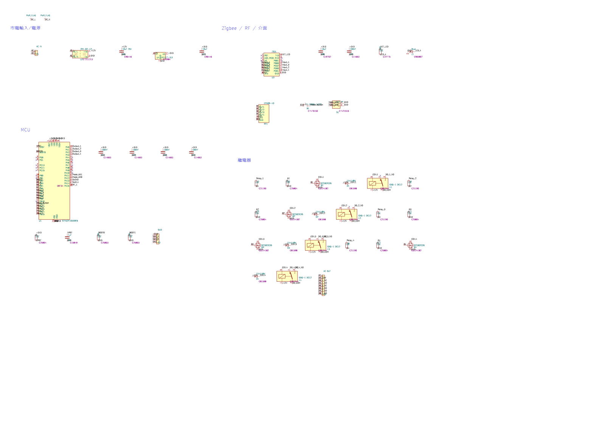
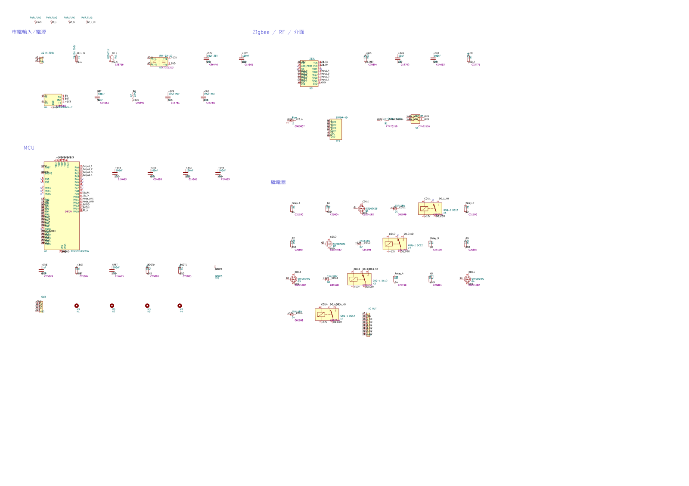
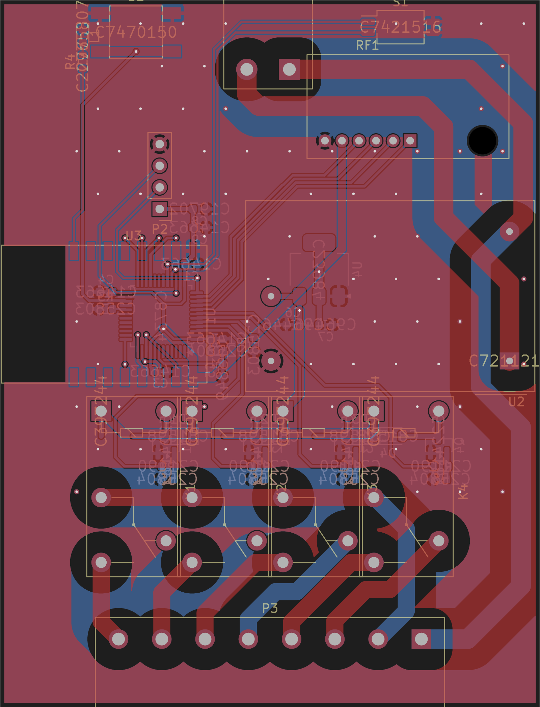
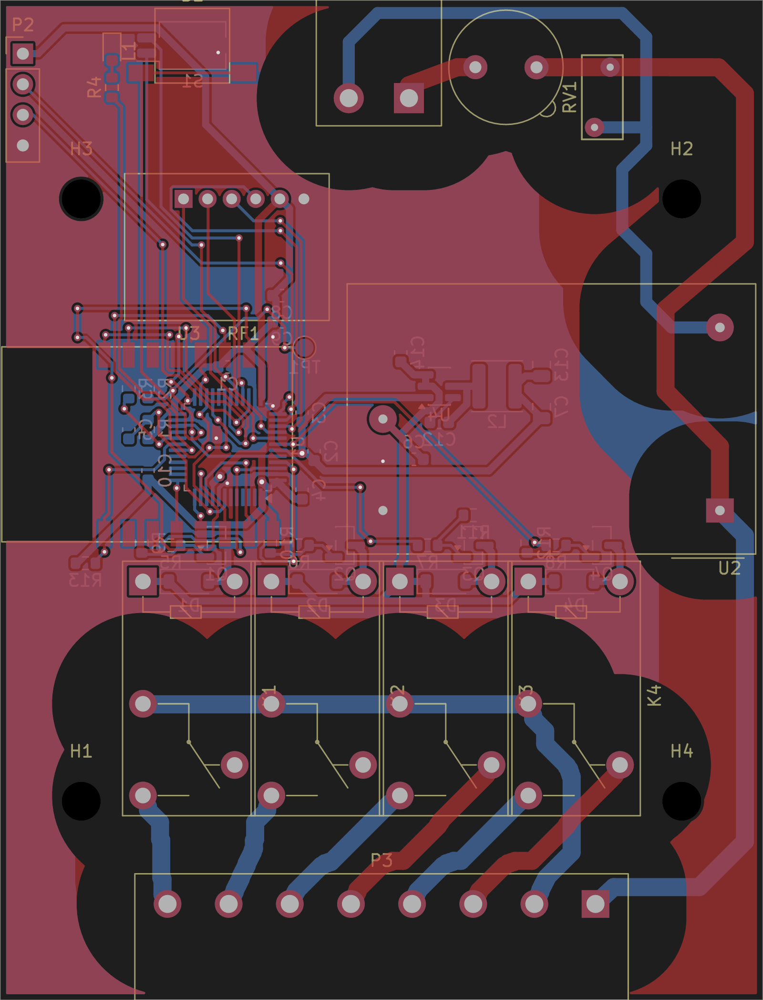

## `hardware/WO30109_FreshAir/WO30109_FreshAir.kicad_sch` (sch)

| Before (ef9fa8c) | After (0b9c355) |
| --- | --- |
|  |  |

`+15` `-0` `~17` `=29`

### Added (15)
- `#FLG03/1` `PWR_FLAG` `power:PWR_FLAG` at `(59.69,20.32)`
- `#FLG04/1` `PWR_FLAG` `power:PWR_FLAG` at `(74.93,20.32)`
- `C10/1` `1uF` `Device:C` at `(35.56,233.68)`
- `C12/1` `100nF` `Device:C` at `(83.82,83.82)`
- `C13/1` `22uF 25V` `Device:C` at `(175.26,83.82)`
- `C14/1` `100nF` `Device:C` at `(208.28,50.80)`
- `F1/1` `T3.15A 250V` `Device:Fuse` at `(66.04,50.80)`
- `H1/1` `M3` `Mechanical:MountingHole` at `(66.04,264.16)`
- `H2/1` `M3` `Mechanical:MountingHole` at `(96.52,264.16)`
- `H3/1` `M3` `Mechanical:MountingHole` at `(127.00,264.16)`
- `H4/1` `M3` `Mechanical:MountingHole` at `(154.94,264.16)`
- `L2/1` `3.9uH` `Device:L` at `(114.30,83.82)`
- `R13/1` `10k` `Device:R` at `(314.96,50.80)`
- `RV1/1` `07D471K` `Device:Varistor` at `(96.52,50.80)`
- `TP1/1` `BOOT0` `Connector:TestPoint` at `(185.42,233.68)`

### Changed (17)
- `B1/1` — pos: `299.72,104.14` → `330.20,104.14`
- `C5/1` — value: `1uF` → `100nF`, pos: `66.04,233.68` → `96.52,233.68`
- `C6/1` — pos: `119.38,50.80` → `177.80,50.80`
- `C7/1` — value: `10uF` → `22uF 25V`, pos: `198.12,50.80` → `144.78,83.82`
- `C8/1` — pos: `314.96,50.80` → `342.90,50.80`
- `C9/1` — pos: `342.90,50.80` → `373.38,50.80`
- `L1/1` — pos: `403.86,50.80` → `251.46,104.14`
- `P1/1` — value: `AC IN` → `AC IN 230V`
- `P2/1` — pos: `154.94,233.68` → `35.56,264.16`
- `R1/1` — pos: `35.56,233.68` → `66.04,233.68`
- `R2/1` — pos: `96.52,233.68` → `127.00,233.68`
- `R3/1` — pos: `127.00,233.68` → `154.94,233.68`
- `R4/1` — pos: `373.38,50.80` → `403.86,50.80`
- `RF1/1` — pos: `259.08,111.76` → `289.56,111.76`
- `S1/1` — pos: `330.20,104.14` → `358.14,104.14`
- `U2/1` — pos: `78.74,53.34` → `137.16,53.34`
- `U4/1` — value: `LM1117-3.3` → `AP63203WU-7`, libId: `Regulator_Linear:AMS1117-3.3` → `Regulator_Switching:AP63203WU`, pos: `157.48,53.34` → `45.72,86.36`

## `hardware/WO30109_FreshAir/WO30109_FreshAir.kicad_pcb` (pcb)

| Before (ef9fa8c) | After (0b9c355) |
| --- | --- |
|  |  |

`+13` `-0` `~40` `=4`

### Added (13)
- `C10` `1uF` `Capacitor_SMD:C_0603_1608Metric` at `(112.30,139.08)`
- `C12` `100nF` `Capacitor_SMD:C_0603_1608Metric` at `(136.50,135.08)`
- `C13` `22uF 25V` `Capacitor_SMD:C_0805_2012Metric` at `(145.00,130.28)`
- `C14` `100nF` `Capacitor_SMD:C_0603_1608Metric` at `(133.30,129.28)`
- `F1` `T3.15A 250V` `Fuse:Fuseholder_TR5_Littelfuse_No560_No460` at `(139.50,105.58)`
- `H1` `M3` `MountingHole:MountingHole_3.2mm_M3` at `(106.75,166.55)`
- `H2` `M3` `MountingHole:MountingHole_3.2mm_M3` at `(156.65,116.52)`
- `H3` `M3` `MountingHole:MountingHole_3.2mm_M3` at `(106.75,116.52)`
- `H4` `M3` `MountingHole:MountingHole_3.2mm_M3` at `(156.65,166.55)`
- `L2` `3.9uH` `Inductor_SMD:L_Sunlord_SWPA4030S` at `(141.30,132.08)`
- `R13` `10k` `Resistor_SMD:R_0603_1608Metric` at `(107.10,146.78)`
- `RV1` `07D471K` `Varistor:RV_Disc_D7mm_W3.4mm_P5mm` at `(150.70,105.58)`
- `TP1` `BOOT0` `TestPoint:TestPoint_Pad_D1.5mm` at `(125.30,128.88)`

### Changed (40)
- `C1` — pos: `122.45,131.03` → `118.90,130.48`
- `C2` — pos: `125.40,139.80` → `126.10,137.48`, angle: `` → `90`
- `C3` — pos: `118.83,143.63` → `125.10,134.28`, angle: `` → `90`
- `C4` — pos: `112.45,134.30` → `125.10,140.68`, angle: `180` → `90`
- `C5` — value: `1uF` → `100nF`, pos: `126.13,143.48` → `110.70,135.68`, angle: `-90` → `90`
- `C6` — pos: `134.39,138.15` → `134.40,138.15`
- `C7` — value: `10uF` → `22uF 25V`, libId: `Capacitor_SMD:C_0603_1608Metric` → `Capacitor_SMD:C_0805_2012Metric`, pos: `138.25,138.15` → `145.00,133.78`, angle: `` → `90`
- `C8` — pos: `123.42,124.55` → `123.42,124.56`
- `D1` — pos: `120.90,151.25` → `115.69,148.29`, angle: `180` → ``
- `D2` — pos: `131.57,151.25` → `126.36,148.29`, angle: `180` → ``
- `D3` — pos: `142.25,151.25` → `137.03,148.29`, angle: `180` → ``
- `D4` — pos: `145.55,151.25` → `147.71,148.29`
- `K1` — libId: `Relay_THT:Relay_SPDT_Omron-G5Q-1` → `WOOW:Relay_SPDT_Omron-G5Q-1_Tight`
- `K2` — libId: `Relay_THT:Relay_SPDT_Omron-G5Q-1` → `WOOW:Relay_SPDT_Omron-G5Q-1_Tight`
- `K3` — libId: `Relay_THT:Relay_SPDT_Omron-G5Q-1` → `WOOW:Relay_SPDT_Omron-G5Q-1_Tight`
- `K4` — libId: `Relay_THT:Relay_SPDT_Omron-G5Q-1` → `WOOW:Relay_SPDT_Omron-G5Q-1_Tight`
- `L1` — pos: `109.70,104.24` → `109.30,104.24`
- `P1` — value: `AC IN` → `AC IN 230V`, pos: `131.47,108.15` → `131.48,108.15`
- `P2` — pos: `118.75,124.55` → `101.90,104.46`, angle: `180` → ``
- `P3` — pos: `131.69,175.08` → `131.70,175.08`
- `Q1` — pos: `119.50,152.31` → `117.99,145.29`, angle: `90` → ``
- `Q2` — pos: `130.17,152.31` → `128.66,145.29`, angle: `90` → ``
- `Q3` — pos: `140.84,152.31` → `139.33,145.29`, angle: `90` → ``
- `Q4` — pos: `151.52,152.31` → `150.01,145.29`, angle: `90` → ``
- `R1` — pos: `125.45,141.25` → `112.30,135.68`, angle: `` → `90`
- `R2` — pos: `129.82,140.50` → `112.30,132.28`, angle: `-90` → `90`
- `R3` — pos: `112.40,136.30` → `110.70,132.28`, angle: `180` → `90`
- `R4` — pos: `109.70,107.27` → `109.30,107.28`
- `R5` — pos: `119.77,154.77` → `114.19,145.29`
- `R6` — pos: `130.45,154.77` → `124.86,145.29`
- `R7` — pos: `141.12,154.77` → `135.53,145.29`
- `R8` — pos: `151.79,154.77` → `146.21,145.29`
- `R9` — pos: `119.62,156.30` → `111.79,145.09`, angle: `180` → `90`
- `R10` — pos: `130.30,156.30` → `122.46,145.09`, angle: `180` → `90`
- `R11` — pos: `140.97,156.30` → `139.33,142.79`, angle: `180` → ``
- `R12` — pos: `151.64,156.30` → `143.81,145.09`, angle: `180` → `90`
- `RF1` — pos: `143.15,116.53` → `120.25,116.52`, angle: `` → `180`
- `S1` — pos: `147.02,103.19` → `116.00,103.78`
- `U3` — pos: `115.67,136.90` → `115.68,136.91`
- `U4` — value: `LM1117-3.3` → `AP63203WU-7`, libId: `Package_TO_SOT_SMD:SOT-223-3_TabPin2` → `Package_TO_SOT_SMD:TSOT-23-6`, pos: `137.47,131.65` → `136.50,132.08`, angle: `90` → ``

### Nets (+7 -7 ~16)
- `+` `/AC_L_IN`
- `+` `/BST`
- `+` `/LED`
- `+` `/SW`
- `+` `/ZB_RST`
- `+` `/ZB_RX`
- `+` `/ZB_TX`
- `-` `/NET_LED`
- `-` `unconnected-(U1-PA10-Pad31)`
- `-` `unconnected-(U1-PA9-Pad30)`
- `-` `unconnected-(U1-PB0-Pad18)`
- `-` `unconnected-(U1-PB1-Pad19)`
- `-` `unconnected-(U3-RST-Pad1)`
- `-` `unconnected-(U3-RXD-Pad15)`
- `~` `P1.1` — `/AC_L` → `/AC_L_IN`
- `~` `R4.1` — `/NET_LED` → `/LED`
- `~` `U1.18` — `unconnected-(U1-PB0-Pad18)` → `/LED`
- `~` `U1.19` — `unconnected-(U1-PB1-Pad19)` → `/ZB_RST`
- `~` `U1.30` — `unconnected-(U1-PA9-Pad30)` → `/ZB_RX`
- `~` `U1.31` — `unconnected-(U1-PA10-Pad31)` → `/ZB_TX`
- `~` `U2.1` — `/AC_N` → `/AC_L`
- `~` `U2.2` — `/AC_L` → `/AC_N`
- `~` `U3.1` — `unconnected-(U3-RST-Pad1)` → `/ZB_RST`
- `~` `U3.15` — `unconnected-(U3-RXD-Pad15)` → `/ZB_RX`
- `~` `U3.16` — `/NET_LED` → `/ZB_TX`
- `~` `U4.1` — `/GND` → `/+3V3`
- `~` `U4.2` — `/+3V3` → `/+12V`
- `~` `U4.4` — `(unconnected)` → `/GND`
- `~` `U4.5` — `(unconnected)` → `/SW`
- `~` `U4.6` — `(unconnected)` → `/BST`
